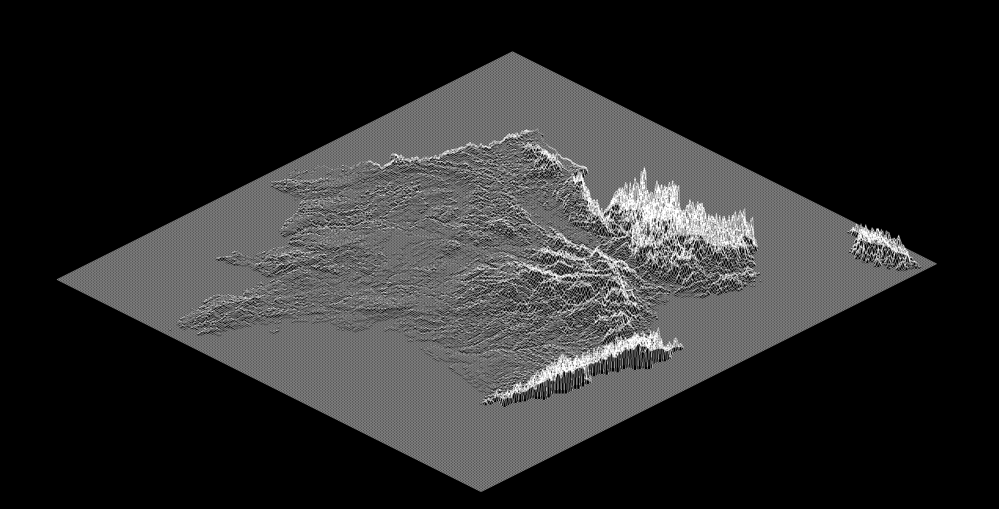

# FdF
1er projet de la branche graphique du [cursus 42](https://www.42.fr).

## Description

Le FdF (Fil de Fer) permet de modéliser une carte en relief à partir d'un fichier de configuration.
La position, la hauteur et l'échelle peuvent être modifiées.


## Usage

```
$> make
$> ./FdF map_file
```

## Exemple imagé


